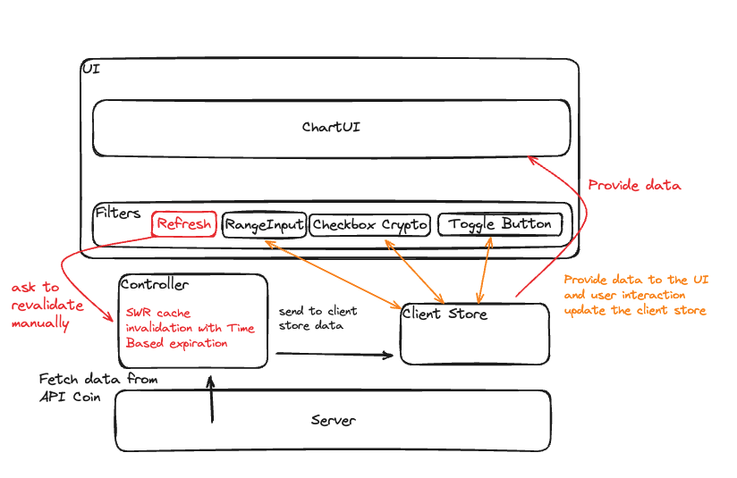

# CRYPTO CURRENCY CHART

Features:

- Display a list of cryptocurrencies with their market capitalization and responsive.
- Allow users to filter cryptocurrencies based on a market cap range.
- Allow users to select specific cryptocurrencies to view.
- Provide a toggle for light/dark mode.
- Provide a refresh button to revalidate data manually.

Architecture

Data Model

Server-originated Data: 
- Data from external API (array of object contains id,market_cap...)
Client-Side State:
- Selected Catgories: array of crypto [bitcoin,..,]
- rangeValue: number value 
- send in serions the x and y axis 

Difficulties Encounter:

- Problem 1: we get big numbers for the cap market variable that can't be display as we get 
- Solution 1 : format the numbers to the same dimension with Intl.NumberFormat (not a npm module, awesome tool) to reduce the gap between them and more user friendly to show 

- Problem 2 : show list with big gap between the first and the others score cap market (bitcoin 1,3T$)
- Solution 2: try with options distribute to reduce the difference and the format in billion and trillion help a lot

- Problem 3: show precise data and show to the user that it's cap market in dollars after we format the number 
- Solution 3: give in dataLabels the precise data with $ currency 

- Probleme 4 : responsiveness of a chart bar 
- Solution 4: I add in options the title and subtite to align differently and let widht and heigt auto. Also I decide to not show Horizontail position because not showing nice view 

- Probleme 5: at the begginning I had the category (xaxis : bitcoin...) in the options part but bother me for the structuration of the project 
- Solution 5: I move with the series data possibility

Conception Idea: 

- try to design the component to be controlled component, the react prefer the compoenent pure.
- I try the most to build generic compoenent that the Parent compoenent pass the props. 
- The container component is handle the data processing and pass to their children 
- Update the logo in tootbar to have a design more modern 

Optimizations and Deep Dive

Performance:

Caching: Utilize SWR's cache to minimize redundant data fetching.

User Experience:

- Loading States: Provide loading indicators during data fetching.
- Error Handling: Display error messages for failed API requests.
- Responsive Design: Ensure components adapt to different screen sizes.

